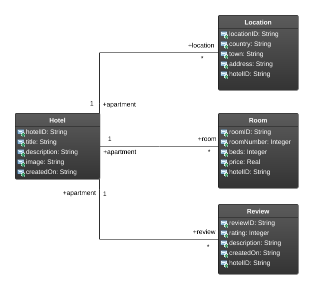
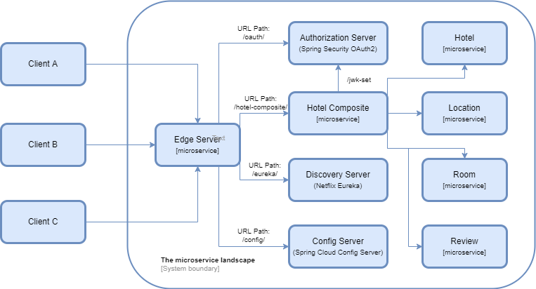

# Hotel Microservices
This application implements a microservice system for managing hotels. The hotel represents the main ie. composite microservice that is connected to all other services, ie each hotel has his own rooms, reviews, locations. Management of this system is enabled by performing implemented CRUD operations on microservice instances. This microservice architecture is implemented with Spring Boot and Spring Cloud. Alongside the aforementioned microservices, Spring Cloud components were used for: Edge Server, Discovery Server, Authorization Server, Config Server.

# Microservice system diagrams

## Database diagram

## Microservice architecture diagram

# Prerequisites
jq - downoload jq and add it to the Path system environment variable. Make sure that the file is named jq. Download jq from here. Alternatively, you can use some of the available installers.
Docker and docker-compose - downoload and install Docker Desktop from here for Windows. Alternatively, for other OSs follow the steps on the Docker web site.
Enable virtualization - if virtualization is not enabled, enable it in the BIOS settings.

# CD Pipeline build/test/deploy

`./gradlew clean build && docker-compose build && docker-compose up -d`

After this, you can run bash test-em-all.bash to test endpoints and general functionality of the system. If the build is complete and you want to start and test the system, you can run ./test-em-all.bash start which will leave the system running but ./test-em-all.bash start stop will after testing, stop it. Also to stop the system at any time, use the command docker-compose down.